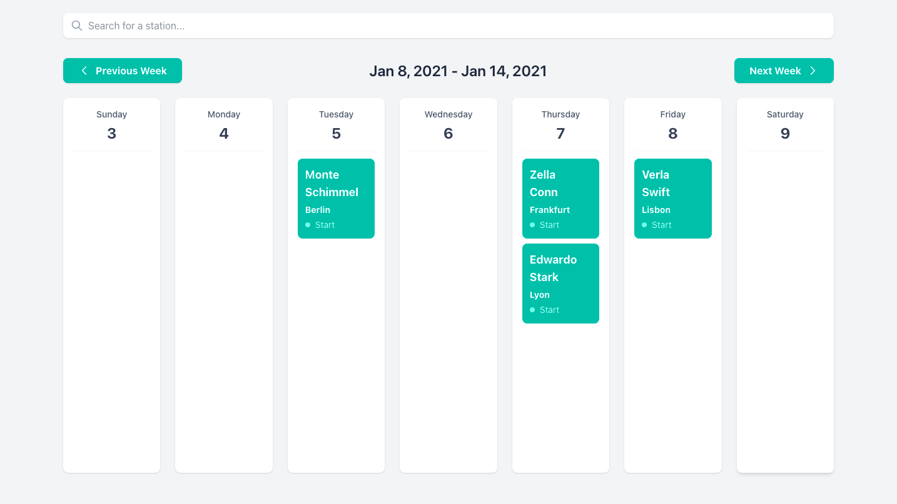
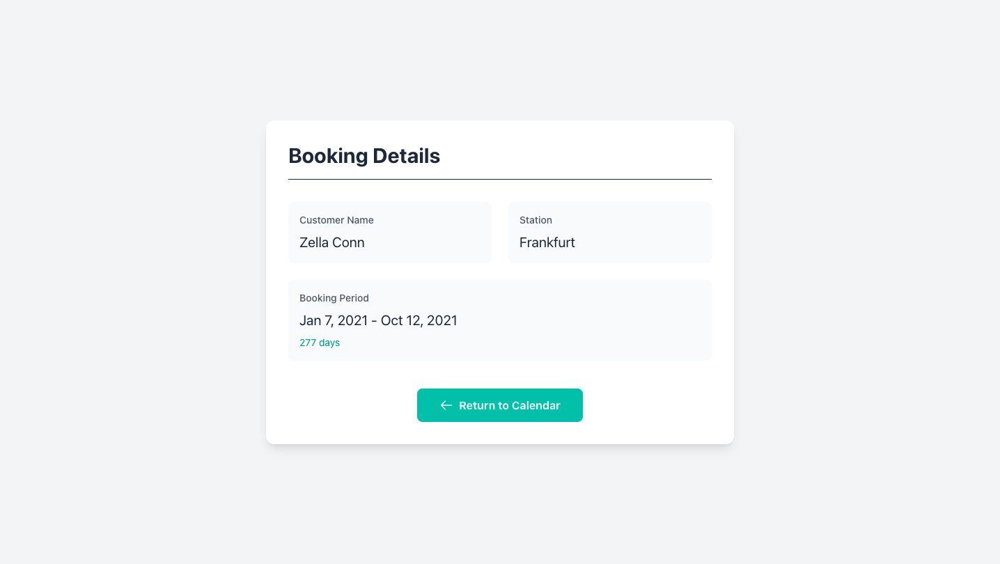

# Frontend Calendar Challenge

A Vue.js application that implements a calendar interface for managing station bookings. Built with Vue 3, Vite, and modern web technologies.

## Demo

Check out the live demo: [Calendar Challenge Demo](https://cesaralvrz.github.io/frontend-coding-challenge/)

## Screenshots

### Calendar View


### Booking Details


## Technologies

- Vue 3 with Composition API and `<script setup>` syntax
- Vite for fast development and building
- Pinia for state management
- Vue Router for navigation
- TailwindCSS for styling
- Vitest + Testing Library for testing
- date-fns for date manipulation

## Features

- Interactive calendar view with week navigation
- Station search with autocomplete
- Drag and drop booking management
- Real-time booking updates
- Responsive design
- Comprehensive test coverage

## Getting Started

### Prerequisites

- Node.js (v14 or higher recommended)
- npm or yarn

### Run project

1. Install dependencies
```bash
npm install
 ```

2. Start development server
```bash
npm run dev
 ```

The application will be available at http://localhost:5173

### Building for Production
```bash
npm run build
 ```

### Running Tests
```bash
npm run test
 ```
## Trae AI
27 context(s) used

I'll help you create a comprehensive README.md for your Vue.js project. Based on the codebase I can see, I'll create a detailed README that includes project overview, setup instructions, and other relevant information.

2. Install dependencies
3. Start development server
The application will be available at http://localhost:5173

### Building for Production
### Running Tests
## Project Structure
## Testing
The project uses Vitest and Testing Library for unit and component testing. Tests can be found in the src/tests directory.

## Development
This template uses Vue 3 <script setup> SFCs. Check out the script setup docs to learn more.

For IDE support and tooling information, refer to the Vue Docs Scaling up Guide .

## License
[Add your license information here]

## cesaralvrz
Copy

Delete

Include eslint and prettier scripts

## Trae AI
Used 1 Reference

README.md 76-76

I'll add the ESLint and Prettier scripts to the README.md. I'll add them under the "Running Tests" section.

```markdown
// ... existing content ...

### Running Tests
```bash
npm run test
 ```

### Linting and Formatting
Run ESLint to check for code style and errors:

```bash
npm run lint
 ```

Run ESLint with automatic fixing:

```bash
npm run lint:fix
 ```

Format code with Prettier:

```bash
npm run format
 ```

## Project Structure
```plaintext
src/
├── assets/         # Static assets
├── components/     # Vue components
├── composables/    # Vue composables (hooks)
├── router/         # Vue Router configuration
├── services/       # API services
├── stores/         # Pinia stores
├── tests/          # Test files
├── utils/          # Utility functions
└── views/          # Page components
 ```
```
